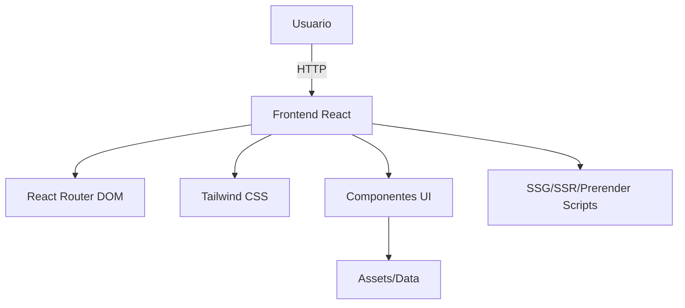

# FyT Lab Connect — Arquitectura Técnica

## 1. Arquitectura actual (As-Is)
FyT Lab Connect es una aplicación front-end desarrollada con React y TypeScript, utilizando Vite como bundler principal. El sistema está orientado a la presentación de información y herramientas especializadas, sin backend propio ni panel administrativo.

### Estructura de carpetas

```
src/
├── assets/           # Imágenes y recursos estáticos
├── components/       # Componentes UI reutilizables
├── config/           # Configuración específica del cliente
├── data/             # Datasets locales y fixtures
├── hooks/            # Hooks personalizados
├── lib/              # Librerías y utilidades compartidas
├── pages/            # Rutas y vistas principales
├── providers/        # Contextos y Providers de React
├── seo/              # Metadatos y rutas meta
├── shims/, types/, utils/ # Tipos, utilidades y adaptadores
```

scripts/
├── audit-runner.mjs, optimize-images.js, prerender-react.mjs, ...
    # Scripts para auditoría, optimización de imágenes, prerender y utilidades de build

### Principales dependencias
- React, React DOM, React Router DOM v6
- TypeScript
- Tailwind CSS y tailwindcss-animate
- Radix UI, Framer Motion, Zod, TanStack React Query

### Flujos principales
- Renderizado SPA con soporte para SSG/SSR y prerender (no SSR en producción actualmente)
- Ruteo con `react-router-dom` y carga diferida (`React.lazy`) de rutas y componentes pesados
- Estilos con Tailwind CSS y utilidades de animación
- Scripts de build y optimización en la carpeta `scripts/`

## 2. Decisiones clave de diseño
- Separación estricta de dominios funcionales en `src/` (investigación, contacto, equipo, etc.)
- Uso de componentes atómicos y reutilizables para UI
- Lazy-loading en rutas y vistas para mejorar el rendimiento inicial
- SSG/SSR y prerender soportados mediante scripts personalizados, pero no desplegados como SSR en producción
- No se incluye backend, panel administrativo ni internacionalización (i18n) en la arquitectura actual

## 3. Evolución prevista (To-Be)
- Consolidar patrones de diseño en `src/components/` (Atomic Design recomendado)
- Documentar y estandarizar el uso de hooks y providers
- Integrar diagramas técnicos en `docs/DIAGRAMS` (Mermaid/SVG)
- Evaluar la integración de pipelines de CI para validación y despliegue automatizado de artefactos pre-renderizados
- Mejorar la documentación de flujos de build y scripts personalizados

## 4. Límites explícitos del sistema
- No incluye backend, autenticación, panel administrativo ni internacionalización
- No gestiona usuarios, roles ni permisos
- No implementa CI/CD ni despliegue automatizado actualmente
- No expone API pública ni endpoints propios

## 5. Diagrama textual de arquitectura



---

## Resumen ejecutivo (ENGLISH)

FyT Lab Connect is a front-end application built with React and TypeScript, using Vite as the main bundler. The project is structured for maintainability and scalability, with clear separation of domains and atomic UI components. It supports SSG/SSR and prerender via custom scripts, but does not include backend, admin panel, authentication, or i18n. The current system focuses on presentation and client-side logic, with technical documentation and build scripts prepared for future evolution.
